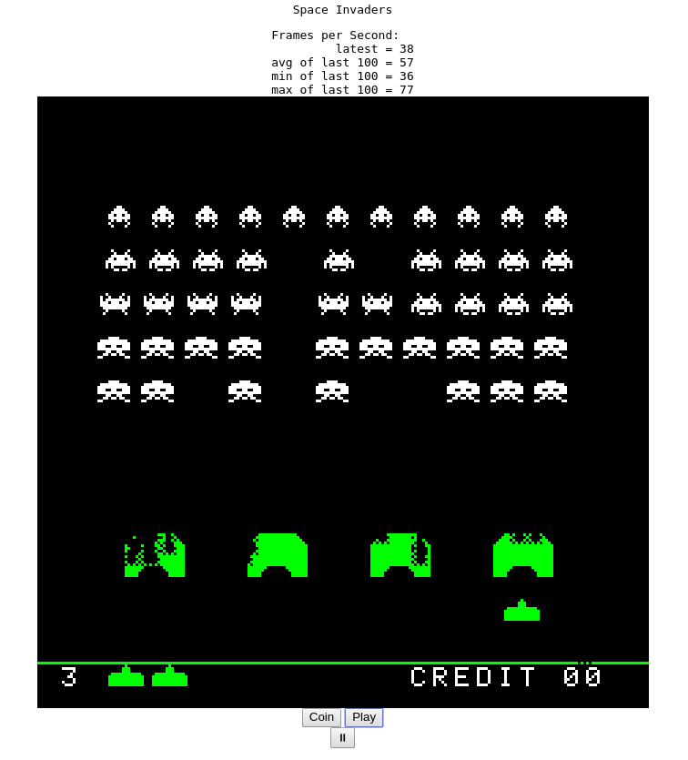

<meta charset="utf-8"/>

# `wasm-invaders`

Space Invaders retro' game powered by wasm and
[rs8080](https://github.com/la10736/rs8080) (a 8080 emulator writen
in Rust).



## Requirment

TODO

- [ ] rustup nightly
- [ ] webpack
- [ ] node

## Compile

To compile use
```
./compile.sh
```

## Prepare node environment

Just use `./init.sh` to link this module in your node envirorment. You need
it just the first time, after that you can forget it.


## Serve

By `./start.s` you can start a web servel on http://localhost:8080 to
serve the app.

